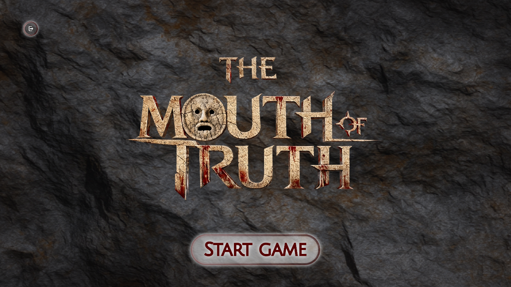
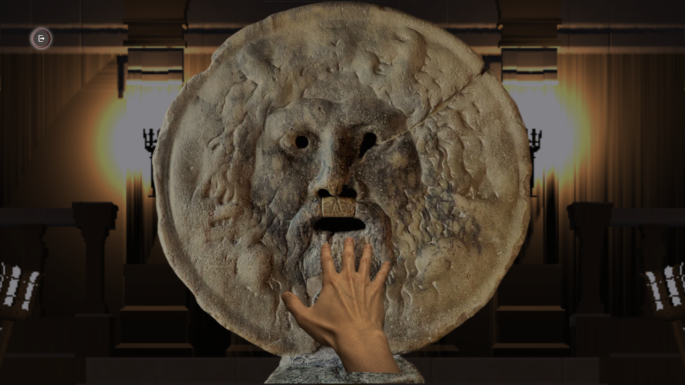

# Mouth of Truth

`Mouth of Truth`는 질문 카드 선택, 손 입력, 음성 답변, 얼굴 캡처를 하나의
의식 흐름으로 묶은 인터랙티브 설치형 게임입니다. 참가자는 진실의 입 앞에서
질문을 고르고 답변하며, 앱은 얼굴 표정과 음성 감정 신호를 결합해 `TRUE`,
`FALSE`, `UNCERTAIN` 결과를 보여줍니다.

Unity는 게임 화면, Ultraleap 손 입력, 마이크 녹음, 웹캠 캡처를 담당합니다.
Python 엔진은 얼굴/음성 분석 결과를 받아 최종 판정을 계산합니다.



## 주요 화면

| 카드 선택 | 질문 확인 |
| --- | --- |
|  |  |
| 손 삽입 | 판정 결과 |
|  |  |

## 플레이 흐름

1. 참가자가 손을 올려 시작합니다.
2. 세 장의 질문 카드 중 하나를 dwell selection으로 고릅니다.
3. 선택된 질문을 듣고 마이크로 답변합니다.
4. 앱이 답변 중 음성 신호와 얼굴 프레임을 수집합니다.
5. Python 분석 엔진이 얼굴/음성 점수를 결합해 판정을 반환합니다.
6. 진실의 입이 `TRUE`, `FALSE`, `UNCERTAIN` 중 하나를 보여줍니다.

## 실행 준비

필수 환경:

```text
Unity Editor 6000.4.1f1
Git
Miniforge, Mambaforge, Anaconda 중 하나
conda-pack
Leap Motion 또는 Ultraleap 호환 장치
Ultraleap Hand Tracking Software
```

저장소를 받은 뒤 Unity Hub에서 `unity-app` 폴더를 엽니다. 저장소 루트가 아니라
Unity 프로젝트 폴더를 열어야 합니다.

```bash
git clone <repository-url>
cd mouth-of-truth

conda env create -f python-engine/environment.yml
conda activate mouth-of-truth
python -m compileall -q python-engine/src
PYTHONPATH=python-engine/src python -m unittest discover -s python-engine/tests
```

## 별도 복원 파일

아래 항목은 라이선스와 용량 때문에 Git에 포함하지 않습니다. 프로젝트 실행 또는
릴리스 빌드 전에 지정 위치에 복원합니다.

| 항목 | 위치 | 안내 |
| --- | --- | --- |
| 얼굴/음성 모델 bundle | `python-engine/models/` | [모델 자산](python-engine/models/README.md) |
| Dungeon Modular Pack | `unity-app/Assets/ThirdParty/Environment/DungeonModularPack/` | [서드파티 자산과 런타임](THIRD_PARTY_ASSETS.md) |
| Persiang Carpets URP | `unity-app/Assets/ThirdParty/Environment/PersianCarpetUrp/` | [서드파티 자산과 런타임](THIRD_PARTY_ASSETS.md) |
| Ultraleap Hand Tracking Software | 실행 PC | [서드파티 자산과 런타임](THIRD_PARTY_ASSETS.md) |
| Python runtime bundle | `python-runtime/`, `python-runtime-windows/` | 릴리스 빌드 시 생성 |

모델 bundle 복원:

```bash
tools/restore-model-assets.sh <path-to>/mouth-of-truth-models-required.tar.gz
```

Windows PowerShell:

```powershell
.\tools\restore-model-assets.ps1 -ModelBundlePath <path-to>\mouth-of-truth-models-required.tar.gz
```

## 프로젝트 구조

```text
unity-app/       Unity 프로젝트, 게임 화면, 입력, 빌드 자동화
python-engine/   얼굴/음성 분석 엔진, Python bridge, 판정 정책
bridge/          Unity와 Python이 JSON 요청/결과를 교환하는 런타임 폴더
tools/           모델 복원, 모델 패키징, 릴리스 빌드 스크립트
docs/            프로젝트 설정과 릴리스 빌드 문서
```

## 주요 문서

- [프로젝트 설정과 릴리스 빌드](docs/setup-and-release.md)
- [서드파티 자산과 런타임](THIRD_PARTY_ASSETS.md)
- [모델 자산](python-engine/models/README.md)

## 판정 정책

Python 브리지 기준:

- 얼굴 증거와 음성 증거가 모두 있으면 `TRUE` 또는 `FALSE`
- 얼굴 또는 음성 증거가 부족하면 `UNCERTAIN`
- 얼굴 점수 가중치: `0.80`
- 음성 점수 가중치: `0.20`
- 최종 결합 점수 `< 33.0`: `TRUE`
- 최종 결합 점수 `>= 33.0`: `FALSE`

수정 위치:

```text
python-engine/src/mouth_of_truth/fusion/judgment_policy.py
python-engine/src/mouth_of_truth/fusion/multimodal_fusion.py
python-engine/src/mouth_of_truth/fusion/verdict_policy.py
unity-app/Assets/Scripts/Game/Analysis/DeterministicAnswerAnalysisClient.cs
```

## 검증

```bash
python -m compileall -q python-engine/src
PYTHONPATH=python-engine/src python -m unittest discover -s python-engine/tests
dotnet build unity-app/Assembly-CSharp.csproj --no-restore /m:1
dotnet build unity-app/Assembly-CSharp-Editor.csproj --no-restore /m:1
```

릴리스 빌드는 필수 Python 런타임 파일과 모델 SHA-256을 자동 검증합니다. 필수
자산이 없거나 checksum이 맞지 않으면 빌드가 중단됩니다.
